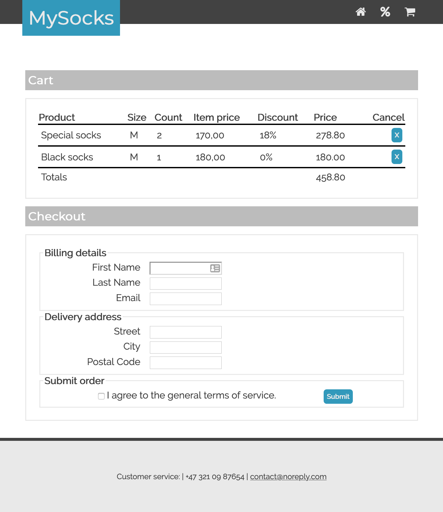
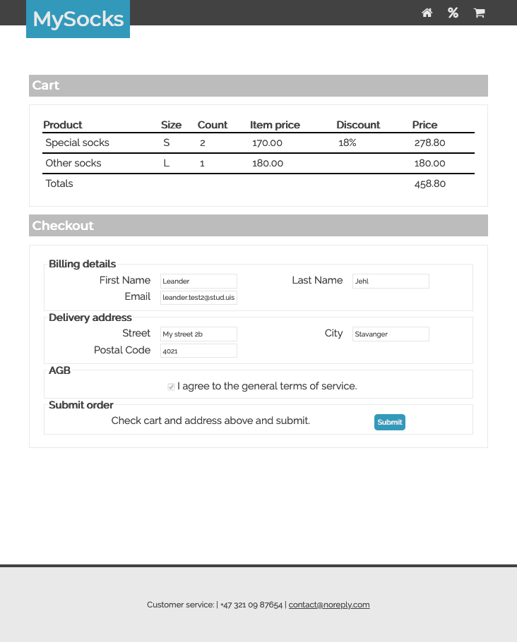
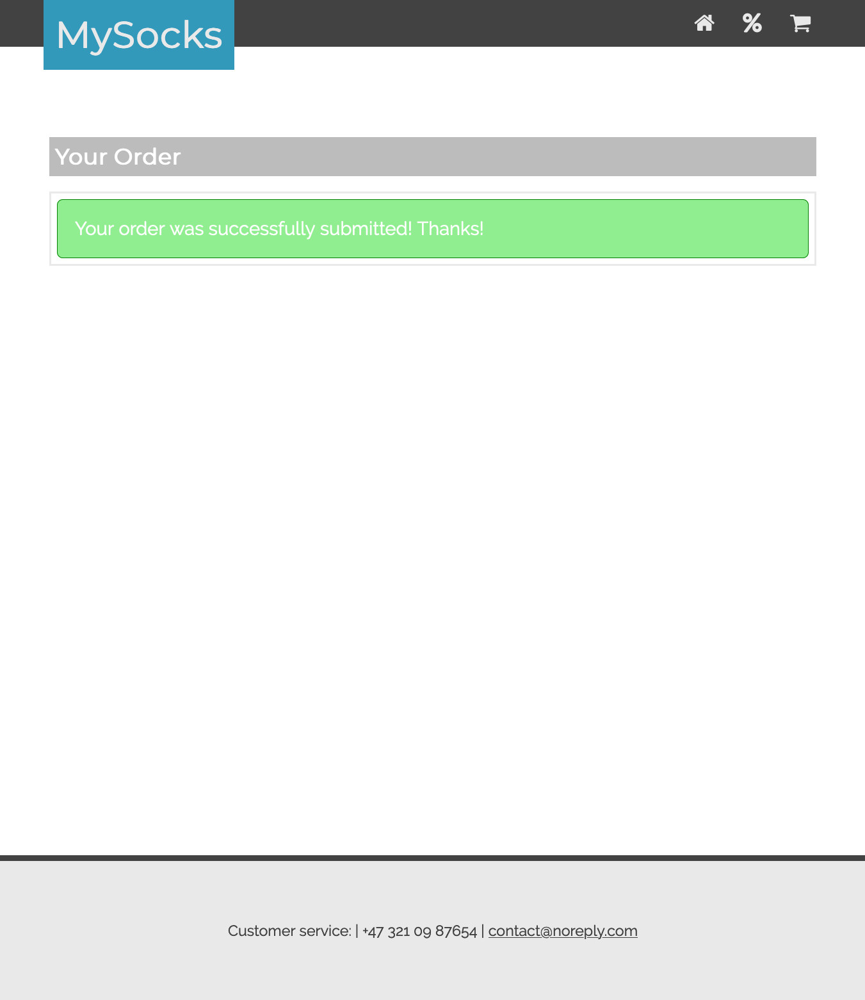

# Assignment 8 (Vue)

In this assignment, you will extend you web-shop mockup from Assignment 3 to a full web application.

You can use the [solution](https://github.com/dat310-spring20/assignments-solutions/tree/master/3) for Assignment 3 in this assignment.
However, there will be extra credit if you use your own solution.

There are again two variants of this assignment. 
 * Using vue or
 * using jinja-templates and session (described in a separate file).
Database access will be the same in both assignments:

I added a [hint](#hint-saving-order-rows) on saving order rows.

### Mysql

Your application should use a database called `dat310`. 
The database contains 3 tables `products`, `orders` and `order_rows`.
Write SQL scripts in `script.sql` for 
* CREATING `products` table
* INSERTING data into `products` table
* CREATING `orders` table
* CREATING `order_rows` table

The CREATE script for `products` is already written. The other tables should contain the following columns:

- `orders` has the following columns:
    - `order_id` an integer, the PRIMARI KEY identifying an order. You can use AUTO INCREMENT here.
    - `first_name` the customers first name
    - `last_name` the customers last name
    - `email` the customers email
    - `street` the street in delivery address
    - `city` city in delivery address
    - `postcode` postcode in delivery addresss

- `order_rows` has the following columns:
    - `row_id` an integer, the PRIMARI KEY identifying an order_row. You can use AUTO INCREMENT here.
    - `product_id` an integer. This is the `product_id` of the product that was ordered. Can be a [FOREIGN KEY](https://www.w3schools.com/sql/sql_foreignkey.asp)
    - `order_id` an integer. This is the `order_id` of the order that this row belongs to. Can be a [FOREIGN KEY](https://www.w3schools.com/sql/sql_foreignkey.asp)
    - `count` an integer. How often this product is ordered.
    - `size` the size in which this product is ordered. Can be a string.


### Vue starter files

Starter files are in the folder called `vue`.
The starter files already contain an already quite complex vue application, including an additional vue instance as store and a vueRouter.
 * `/static/index.html` already contains the main structure for your application and a router-view.
 * `/static/app.js`: here the main vue instance is defined. This file also contains the `VueRouter`. You will have to add additional routes for `/cart`.
 * `/static/store.js` contains an additional vue instance used as store.
 The store is meant to contain a object, containing all products and a list of items in the shopping cart.
 On creation the store sends an AJAX request to the backend (`/products`) to retrieve the products.
 * `/static/components/` this folder contains different components:
   - `main.js` contains the main page. It displays the products in the store.
   - `product.js` contains the product page. This component receives on product_id (pid) as `props`, retrieves this product from the store and displays it.s
   - `aside-cart.js` displays the cart summary shown on both main and product page.

#### Client side TODO (Vue):
You need to implement the following checkout flow:
  * `/cart`: displays the cart and address form.
    - All fields in the form should be required.
    - Implement also the cancel buttons, used to remove items from the cart.




  * hitting submit on the cart, the user comes to `/checkout` where he can review and approve his order.


 
  * hitting submit on checkout, the address and cart is sent to the server using an AJAX request. Once the server has stored the information in the database, the user is shown a confirmation.



#### Server side TODO (Vue):
You need to complete the `script.sql` as described above.
Additionally you need to implement the two endpoints `/products` and `/order`. 

* `/products` retrieves products from the database and sends them as JSON.
* `/order` gets an address and cart from the frontent, and saves to the `orders` and `order_rows` tables.

#### Hint: Saving order rows:

If your orders table has a `order_id` that is set to autoincrement, you can do the following:
To save the order, first insert the address data into the `orders` table. Then you can retrieve the id of your new order as `lastrowid` and use it when inserting into the order_row table. 
This might look like the code below:

```python
cur.execute(orders_table_sql, arguments)
orderid = cur.lastrowid
for item in cart:
  item['orderid'] = orderid
  cur.execute(order_rows_sql, item)
```

#  Øving 8 (Vue)

I denne oppgaven skal du utvide din web-shop-mockup fra Innlevering 3 til en fulstendig webapplikasjon.

Du kan bruke [løsningen](https://github.com/dat310-spring20/assignments-solutions/tree/master/3) for Innlevering 3 i denne oppgaven. Det vil imidlertid bli gitt ekstra kreditt hvis du bruker din egen løsning.

Det er igjen to varianter av denne oppgaven.
  * Bruke vue, som beskrevet under eller
  * bruk jinja-templates og session (beskrevet i en egen fil).


Jeg la til [tips](#hint-saving-order-rows) on saving order rows.

Databasetilgang vil være den samme i begge oppgavene:

### Mysql

Din applikasjon skal bruke en database nevnt `dat310`. 
Databasen innehoder 3 tabeller `products`, `orders`, og `order_rows`.
Skriv SQL scripts i `script.sql` for 
* CREATING `products` tabellen
* INSERTING data i `products` tabellen
* CREATING `orders` tabellen
* CREATING `order_rows` tabellen

CREATE scriptet for `products` er allerede på plass. De andre tabellene skal inneholde følgende kolonner:

- `orders` har følgende kolonner:
    - `order_id` en integer, PRIMARI KEY som identifiserer en order. Du kan bruke AUTO INCREMENT her.
    - `first_name` kundens fornavn
    - `last_name` kundens etternavn
    - `email` kundens epost
    - `street` gateadresse til kunden
    - `city` bosted til kunden
    - `postcode` postkode i addressen

- `order_rows` har følgende kolonner:
    - `row_id` en integer, PRIMARI KEY som identifiserer en order_row. Du kan bruke AUTO INCREMENT her.
    - `product_id` en integer. Dette er `product_id` av produktet som er bestillt. Kan være en  [FOREIGN KEY](https://www.w3schools.com/sql/sql_foreignkey.asp)
    - `order_id` en integer. Dette er `order_id` for bestillingen denne raden hører til. Kan være en [FOREIGN KEY](https://www.w3schools.com/sql/sql_foreignkey.asp)
    - `count` en integer. Hvor ofte dette produktet ble bestilt.
    - `size` størrelsen som dette produktet bestilles i. Kan være en streng.


### Vue start filer

Startfiler er i mappen som heter `vue`.
Startfilene inneholder allerede en ganske komplekst vue-applikasjon, inkludert en ekstra vue instans som store og en vueRouter.
 * `/static/index.html` inneholder hovedstrukturen for applikasjonen din og en router-view.
 * `/static/app.js`: her er vue instansen definert. Denne fila inneholder også en `VueRouter`. Du må legge til en route for `/cart`.
 * `/static/store.js` inneholder en ekstra instans av vue som brukes som store, i.e. for å holde data. Storen er ment å inneholde et objekt med alle produkter i butikken og en liste med ting i handle vognen. Ved opprettelse av storen sendes en AJAX request til backenden (`/products`) for å laste inn produktene.
 * `/static/components/` denne mappen inneholder forskjellige komponenter:
   - `main.js` inneholder hovedsiden. Den viser produktene i butikken.
   - `product.js` inneholder produktsiden. Denne komponenten mottar en product_id (pid) som `props`, henter dette produktet fra store og viser det.
   - `aside-cart.js` viser sammendraget om handlekurven som vises på både hovedsiden og produktsiden.

#### Client side TODO:
Du må implementere følgende checkout flow:
  * `/cart`: viser handlekurven or et skjema for leveringsaddressen.
    - Alle felt i skjemaet skal være **required**.
    - Implementer også avbryt-knappene som brukes til å fjerne elementer fra handlekurven.


  * ved å trykke submit kommer brukeren til `/checkout` hvor han kan se gjennom og godkjenne bestillingen.


 
  * ved å trykke submit igjen, blir addressen og innhold i hanldevognen sent til serveren som en AJAX request. Når serveren har lagret informasjonen i databasen, får brukeren en bekreftelse.


#### Server side TODO (Vue):
Du må fullføre `script.sql` som beskrevet ovenfor.
I tillegg må du implementere de to endepunktene `/products` og` /order`.
* `/products` henter produkter fra databasen og sender dem som JSON.
* `/order` får en addresse og handlekurv fra browseren og larger i tabellene `orders` og `order_rows`.

#### Hint: Saving order rows:

If your orders table has a `order_id` that is set to autoincrement, you can do the following:
To save the order, first insert the address data into the `orders` table. Then you can retrieve the id of your new order as `lastrowid` and use it when inserting into the order_row table. 
This might look like the code below:

```python
cur.execute(orders_table_sql, arguments)
orderid = cur.lastrowid
for item in cart:
  item['orderid'] = orderid
  cur.execute(order_rows_sql, item)
```
